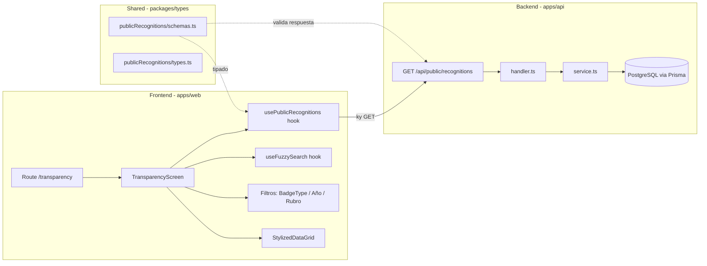
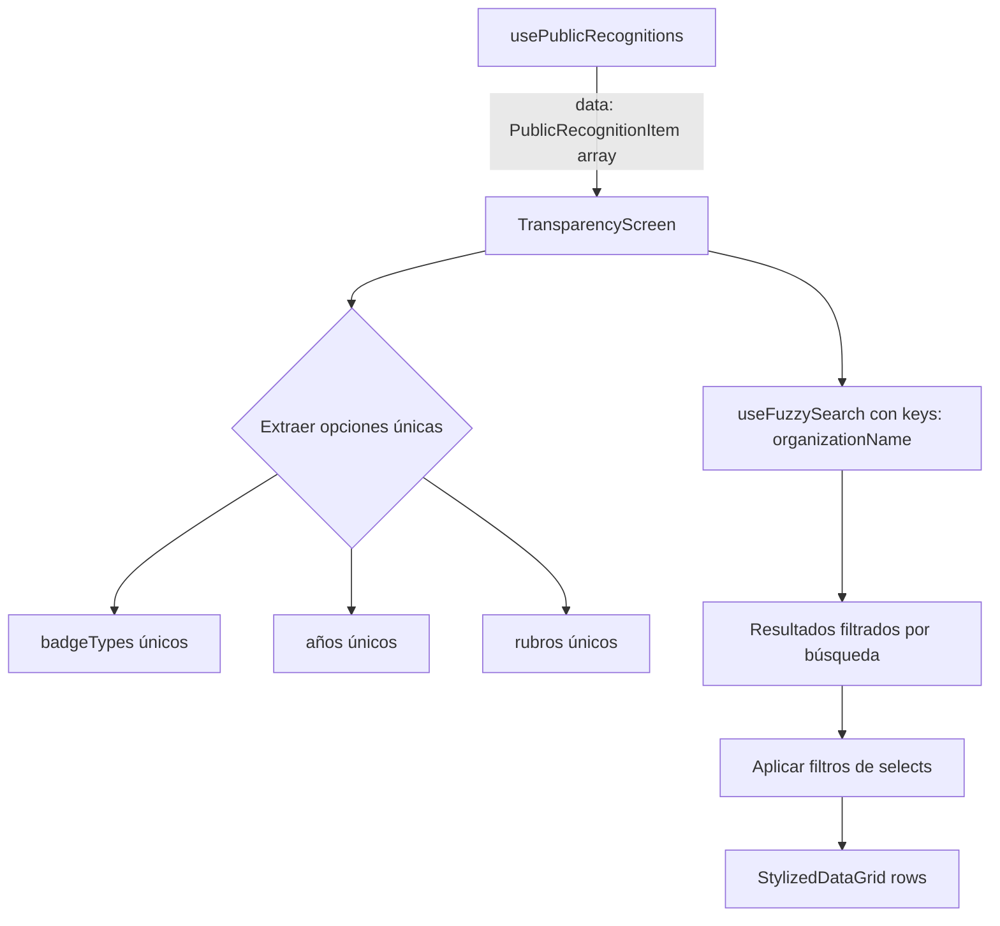

# Diseño — Vista Pública de Reconocimientos

## Resumen

Esta funcionalidad expone un endpoint público `GET /api/public/recognitions` que retorna las organizaciones activas con reconocimientos aprobados, y una vista frontend en `/transparency` que reemplaza la pantalla "En Construcción". La vista muestra una tabla (MUI DataGrid) con búsqueda difusa (Fuse.js) y filtros por tipo de reconocimiento, año y rubro.

El diseño está pensado como POC y prioriza la simplicidad. No requiere migraciones de base de datos — se consultan los modelos existentes con Prisma. El trabajo se divide en 3 agentes paralelos: backend, frontend wiring (query hooks + tipos), y frontend UI.

## Arquitectura



### Decisiones de diseño

1. **Endpoint separado bajo `/api/public/`**: Se crea un nuevo prefijo `public` en las rutas API para endpoints sin autenticación. Esto es más limpio que agregar `config: { public: true }` a rutas existentes bajo scopes autenticados.

2. **Filtrado client-side**: Dado que es un POC y el volumen de datos es bajo, los filtros y la búsqueda difusa se aplican en el frontend sobre los datos ya cargados. Esto simplifica el backend (un solo query sin parámetros) y permite filtrado instantáneo.

3. **Una fila por reconocimiento**: El endpoint retorna una entrada por cada combinación organización-reconocimiento, no una fila por organización con array de badges. Esto simplifica el DataGrid.

## Componentes e Interfaces

### Backend (apps/api)

#### Nuevos archivos

| Archivo                                                                     | Responsabilidad                                          |
| --------------------------------------------------------------------------- | -------------------------------------------------------- |
| `apps/api/src/features/publicRecognitions/getPublicRecognitions/service.ts` | Query Prisma que obtiene reconocimientos aprobados       |
| `apps/api/src/features/publicRecognitions/getPublicRecognitions/handler.ts` | Handler HTTP que invoca el servicio                      |
| `apps/api/src/features/publicRecognitions/getPublicRecognitions/route.ts`   | Registro de ruta Fastify con schema Zod                  |
| `apps/api/src/routes/api/public/recognitions/index.ts`                      | Registro de ruta bajo prefijo `/api/public/recognitions` |
| `apps/api/src/routes/api/public/index.ts`                                   | Registro del scope `/api/public` (sin auth hooks)        |

#### Interfaz del servicio

```typescript
// service.ts
export const getPublicRecognitionsService = async (
  prismaClient: PrismaClient
): Promise<GetPublicRecognitionsResponse> => { ... }
```

#### Registro de ruta

```typescript
// route.ts
export const getPublicRecognitionsRoute: StandardRouteSignature = (fastify) => {
  fastify.get<{ Reply: GetPublicRecognitionsResponse }>(
    "/",
    {
      schema: {
        tags: ["public"],
        summary: "Get public recognitions",
        response: {
          200: GetPublicRecognitionsResponseSchema,
        },
      },
      config: { public: true },
    },
    getPublicRecognitionsHandler
  );
};
```

### Shared Types (packages/types)

#### Nuevos archivos

| Archivo                                            | Responsabilidad            |
| -------------------------------------------------- | -------------------------- |
| `packages/types/src/publicRecognitions/schemas.ts` | Esquemas Zod de respuesta  |
| `packages/types/src/publicRecognitions/types.ts`   | Tipos TypeScript inferidos |
| `packages/types/src/publicRecognitions/index.ts`   | Re-exports                 |

### Frontend Wiring (apps/web)

#### Nuevos archivos

| Archivo                                                              | Responsabilidad                |
| -------------------------------------------------------------------- | ------------------------------ |
| `apps/web/src/api/query/publicRecognitions/keys.ts`                  | Query keys para TanStack Query |
| `apps/web/src/api/query/publicRecognitions/usePublicRecognitions.ts` | Hook de query                  |
| `apps/web/src/api/query/publicRecognitions/index.ts`                 | Re-exports                     |

### Frontend UI (apps/web)

#### Nuevos archivos

| Archivo                                                    | Responsabilidad                     |
| ---------------------------------------------------------- | ----------------------------------- |
| `apps/web/src/screens/Transparency/TransparencyScreen.tsx` | Componente principal de la pantalla |
| `apps/web/src/screens/Transparency/index.ts`               | Re-export                           |

#### Archivos modificados

| Archivo                                | Cambio                                                        |
| -------------------------------------- | ------------------------------------------------------------- |
| `apps/web/src/routes/transparency.tsx` | Reemplazar `UnderConstructionScreen` por `TransparencyScreen` |
| `apps/web/src/api/query/index.ts`      | Agregar export de `publicRecognitions`                        |
| `packages/types/src/index.ts`          | Agregar export de `publicRecognitions`                        |

## Modelos de Datos

### Esquema de respuesta del endpoint

```typescript
// packages/types/src/publicRecognitions/schemas.ts
import { z } from "zod";
import { BadgeTypeSchema } from "../baseSchemas/badge.js";

export const PublicRecognitionItemSchema = z.object({
  organizationName: z.string(),
  badgeType: BadgeTypeSchema,
  year: z.number().int().nullable(),
  sectorName: z.string().nullable(),
});

export const GetPublicRecognitionsResponseSchema = z.array(
  PublicRecognitionItemSchema
);
```

```typescript
// packages/types/src/publicRecognitions/types.ts
import { z } from "zod";
import type {
  PublicRecognitionItemSchema,
  GetPublicRecognitionsResponseSchema,
} from "./schemas.ts";

export type PublicRecognitionItem = z.infer<typeof PublicRecognitionItemSchema>;
export type GetPublicRecognitionsResponse = z.infer<
  typeof GetPublicRecognitionsResponseSchema
>;
```

### Query Prisma

El servicio ejecuta un query que navega la cadena de relaciones:

```
Organization (status=ACTIVE)
  → CarbonInventory (status=ACTIVE)
    → SubmissionSubjectCarbonInventory
      → SubmissionSubject
        → Submission (status=APPROVED)
          → Badge (type: BadgeType)
  → OrganizationData (status=ACTIVE)
    → CountrySector (name)
```

```typescript
// Pseudocódigo del query
const inventories = await prisma.carbonInventory.findMany({
  where: {
    status: "ACTIVE",
    organization: { status: "ACTIVE" },
    submission: {
      subject: {
        submissions: {
          some: {
            status: "APPROVED",
            badge: { isNot: null },
          },
        },
      },
    },
  },
  select: {
    year: true,
    organization: {
      select: {
        data: {
          where: { status: "ACTIVE" },
          select: {
            legalName: true,
            tradeName: true,
            sector: { select: { name: true } },
          },
          take: 1,
        },
      },
    },
    submission: {
      select: {
        subject: {
          select: {
            submissions: {
              where: { status: "APPROVED", badge: { isNot: null } },
              select: {
                badge: { select: { type: true } },
              },
            },
          },
        },
      },
    },
  },
});
```

El servicio luego aplana los resultados en un array de `PublicRecognitionItem`, usando `tradeName ?? legalName` como nombre de la organización.

### Flujo de datos en el frontend



## Propiedades de Correctitud

_Una propiedad es una característica o comportamiento que debe cumplirse en todas las ejecuciones válidas de un sistema — esencialmente, una declaración formal sobre lo que el sistema debe hacer. Las propiedades sirven como puente entre especificaciones legibles por humanos y garantías de correctitud verificables por máquina._

### Propiedad 1: Correctitud de la salida del servicio

_Para cualquier_ estado de base de datos con organizaciones, inventarios de carbono y submissions, cada elemento retornado por `getPublicRecognitionsService` debe: (a) tener todos los campos requeridos (`organizationName` no vacío, `badgeType` válido, `year` numérico o null, `sectorName` string o null), (b) corresponder a una organización con estado ACTIVE, y (c) corresponder a una submission con estado APPROVED.

**Validates: Requirements 1.2, 1.3, 1.4**

### Propiedad 2: Una entrada por reconocimiento

_Para cualquier_ organización activa con N reconocimientos aprobados (submissions con badge y status APPROVED), el servicio debe retornar exactamente N entradas para esa organización en la respuesta.

**Validates: Requirements 1.5**

### Propiedad 3: Búsqueda difusa filtra por nombre de organización

_Para cualquier_ conjunto de `PublicRecognitionItem[]` y cualquier query de búsqueda no vacío, todos los elementos retornados por `useFuzzySearch` deben tener un `organizationName` que sea un match difuso del query según la configuración de Fuse.js.

**Validates: Requirements 3.2**

### Propiedad 4: Filtrado conjuntivo

_Para cualquier_ conjunto de `PublicRecognitionItem[]` y cualquier combinación de valores de filtro (badgeType, año, rubro), cada fila visible en la tabla debe satisfacer TODOS los filtros activos simultáneamente. Es decir, si se selecciona un badgeType y un año, cada fila debe coincidir con ambos.

**Validates: Requirements 4.4**

### Propiedad 5: Opciones de filtro derivadas de los datos

_Para cualquier_ conjunto de `PublicRecognitionItem[]`, las opciones disponibles en cada selector de filtro deben ser exactamente los valores únicos presentes en el campo correspondiente de los datos (sin duplicados, sin valores ausentes en los datos).

**Validates: Requirements 4.6**

## Manejo de Errores

| Escenario                     | Backend                               | Frontend                                                                                                         |
| ----------------------------- | ------------------------------------- | ---------------------------------------------------------------------------------------------------------------- |
| Sin reconocimientos aprobados | Retorna `[]` con HTTP 200             | Muestra mensaje "No se encontraron reconocimientos"                                                              |
| Error de base de datos        | Retorna HTTP 500 con mensaje genérico | Muestra mensaje de error con botón "Reintentar"                                                                  |
| Filtros sin resultados        | N/A (filtrado client-side)            | Muestra mensaje "No hay resultados para los criterios seleccionados" en el DataGrid via `localeText.noRowsLabel` |
| Timeout de red                | N/A                                   | TanStack Query maneja retry automático; muestra error si falla                                                   |

## Estrategia de Testing

### Testing dual: unitarios + propiedades

Se utilizan ambos enfoques de forma complementaria:

- **Tests unitarios**: Verifican ejemplos específicos, edge cases y estados de UI
- **Tests de propiedades**: Verifican invariantes universales sobre todos los inputs posibles

### Librería de property-based testing

- **Backend (apps/api)**: `fast-check` con Vitest (ya disponible `@faker-js/faker` en devDeps; agregar `fast-check`)
- **Frontend (apps/web)**: `fast-check` con Vitest

### Configuración de tests de propiedades

- Mínimo **100 iteraciones** por test de propiedad
- Cada test debe incluir un comentario referenciando la propiedad del diseño
- Formato del tag: `Feature: public-recognitions-view, Property {N}: {título}`

### Tests unitarios del backend

| Test                                                                       | Valida       |
| -------------------------------------------------------------------------- | ------------ |
| El servicio retorna datos correctos para reconocimientos aprobados         | Req 1.2, 1.3 |
| El servicio excluye submissions no aprobadas (PENDING, REJECTED, OBJECTED) | Req 1.3      |
| El servicio excluye organizaciones no activas (BLOCKED)                    | Req 1.4      |
| El servicio retorna array vacío cuando no hay reconocimientos              | Req 1.6      |
| El endpoint responde sin autenticación                                     | Req 1.1      |

### Tests de propiedades del backend

| Test                                                                                 | Propiedad   |
| ------------------------------------------------------------------------------------ | ----------- |
| Feature: public-recognitions-view, Property 1: Correctitud de la salida del servicio | Propiedad 1 |
| Feature: public-recognitions-view, Property 2: Una entrada por reconocimiento        | Propiedad 2 |

### Tests unitarios del frontend

| Test                                                             | Valida            |
| ---------------------------------------------------------------- | ----------------- |
| TransparencyScreen muestra indicador de carga                    | Req 5.1           |
| TransparencyScreen muestra mensaje vacío cuando no hay datos     | Req 5.2           |
| TransparencyScreen muestra mensaje de error con botón reintentar | Req 5.3           |
| TransparencyScreen renderiza las 4 columnas esperadas            | Req 2.1           |
| Los filtros muestran selectores de BadgeType, año y rubro        | Req 4.1, 4.2, 4.3 |

### Tests de propiedades del frontend

| Test                                                                                     | Propiedad   |
| ---------------------------------------------------------------------------------------- | ----------- |
| Feature: public-recognitions-view, Property 3: Búsqueda difusa filtra por nombre         | Propiedad 3 |
| Feature: public-recognitions-view, Property 4: Filtrado conjuntivo                       | Propiedad 4 |
| Feature: public-recognitions-view, Property 5: Opciones de filtro derivadas de los datos | Propiedad 5 |

### División de trabajo para 3 agentes

| Agente              | Scope                                          | Archivos                                                                                            |
| ------------------- | ---------------------------------------------- | --------------------------------------------------------------------------------------------------- |
| **Backend**         | Endpoint + servicio + ruta + tests backend     | `apps/api/src/features/publicRecognitions/**`, `apps/api/src/routes/api/public/**`, tests           |
| **Frontend Wiring** | Tipos compartidos + query hooks                | `packages/types/src/publicRecognitions/**`, `apps/web/src/api/query/publicRecognitions/**`, exports |
| **Frontend UI**     | Pantalla + filtros + búsqueda + tests frontend | `apps/web/src/screens/Transparency/**`, `apps/web/src/routes/transparency.tsx`, tests               |
