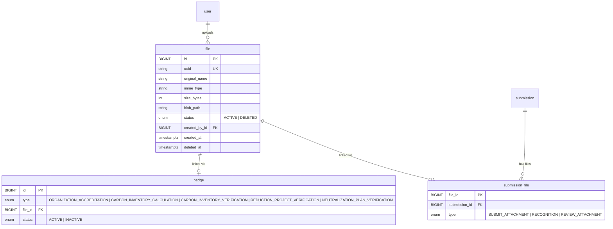

# Almacenamiento de Archivos (File Upload & Download)

## Tabla de Contenidos

- [Almacenamiento de Archivos (File Upload \& Download)](#almacenamiento-de-archivos-file-upload--download)
  - [Tabla de Contenidos](#tabla-de-contenidos)
  - [Descripción General](#descripción-general)
  - [Modelo de Datos](#modelo-de-datos)
    - [Decisiones de Diseño](#decisiones-de-diseño)
    - [Enums](#enums)
    - [Tablas](#tablas)
      - [`file`](#file)
      - [`badge` (link table)](#badge-link-table)
      - [`submission_file` (link table)](#submission_file-link-table)
    - [Diagrama ER (parcial)](#diagrama-er-parcial)
  - [Infraestructura (Bicep)](#infraestructura-bicep)
    - [Contenedor de Blobs](#contenedor-de-blobs)
    - [RBAC y Managed Identity](#rbac-y-managed-identity)
    - [Wiring en `main.bicep`](#wiring-en-mainbicep)
    - [Variables de Entorno en App Service](#variables-de-entorno-en-app-service)
  - [Backend (API)](#backend-api)
    - [Plugin de Blob Storage](#plugin-de-blob-storage)
    - [Autenticación: DefaultAzureCredential](#autenticación-defaultazurecredential)
    - [Estructura de Features](#estructura-de-features)
    - [Flujo de Subida (SAS dos pasos)](#flujo-de-subida-sas-dos-pasos)
    - [Endpoints](#endpoints)
      - [Badges (`/api/files/badge`)](#badges-apifilesbadge)
      - [Submissions (`/api/files/submission`)](#submissions-apifilessubmission)
      - [Archivo individual (`/api/files`)](#archivo-individual-apifiles)
    - [Almacenamiento en Blob: blobPath](#almacenamiento-en-blob-blobpath)
  - [Desarrollo Local](#desarrollo-local)
    - [Permisos RBAC automáticos para desarrolladores](#permisos-rbac-automáticos-para-desarrolladores)
    - [Pasos](#pasos)
  - [Deployment](#deployment)
  - [Archivos Involucrados](#archivos-involucrados)
    - [Archivos Creados](#archivos-creados)
    - [Archivos Modificados](#archivos-modificados)
  - [Referencias](#referencias)

---

## Descripción General

El sistema permite subir, listar, previsualizar, descargar y eliminar archivos asociados a dos subdominios:

| Subdominio      | Entidad propietaria | Caso de uso                                              |
| --------------- | ------------------- | -------------------------------------------------------- |
| **Badges**      | `BadgeType` (enum)  | Imágenes SVG de insignias por tipo de huella             |
| **Submissions** | `submission.id`     | Adjuntos y certificados de reconocimiento de submissions |

Los archivos se almacenan en **Azure Blob Storage** y los metadatos se persisten en **PostgreSQL** a través de Prisma. La autenticación contra Azure Storage se realiza mediante **Managed Identity** (sin claves ni connection strings).

La subida de archivos sigue un **flujo SAS de dos pasos**: el cliente solicita una URL firmada temporal, sube directamente a Azure Blob Storage y luego confirma la operación a la API para crear el registro en base de datos.

---

## Modelo de Datos

### Decisiones de Diseño

1. **Patrón polimórfico con link tables**: La tabla `file` es genérica y las tablas `badge` y `submission_file` actúan como link tables que vinculan un archivo a su entidad propietaria. Esto evita foreign keys nullable y mantiene la tabla principal limpia.

2. **Soft delete**: Los archivos no se eliminan físicamente. El campo `status` cambia de `ACTIVE` a `DELETED`. El blob en Azure Storage se preserva.

3. **`blobPath` como único dato de ubicación**: Solo se guarda la ruta relativa dentro del contenedor. El nombre de la cuenta y el contenedor vienen de variables de entorno, no se duplican por archivo.

4. **`mimeType` y `sizeBytes` leídos desde Azure**: Al confirmar la subida, la API obtiene `contentType` y `contentLength` directamente de las propiedades del blob en Azure. El cliente no necesita enviarlos, lo que garantiza valores fidedignos.

5. **`uuid` para referencia externa**: Cada archivo tiene un UUID único para usar como identificador público sin exponer el ID autoincremental interno.

6. **Badges con estado propio**: La tabla `badge` tiene un campo `status` (`ACTIVE`/`INACTIVE`). Al subir una nueva imagen para un tipo de badge, la anterior se desactiva automáticamente en la misma transacción.

7. **Separación de subdomains**: Las rutas de badges y submissions están registradas bajo prefijos dedicados (`/badge`, `/submission`), con parámetros de ruta tipados individualmente (`BadgeTypeSchema` vs `IdSchema`). Esto elimina el uso de `z.union` en los params de Fastify, que causaba incompatibilidad con `ZodTypeProvider`.

### Enums

```
FileType:            SUBMISSION | BADGE
FileStatus:          ACTIVE | DELETED
BadgeType:           ORGANIZATION_ACCREDITATION | CARBON_INVENTORY_CALCULATION | CARBON_INVENTORY_VERIFICATION | REDUCTION_PROJECT_VERIFICATION | NEUTRALIZATION_PLAN_VERIFICATION
BadgeStatus:         ACTIVE | INACTIVE
SubmissionFileType:  SUBMIT_ATTACHMENT | RECOGNITION | REVIEW_ATTACHMENT
```

### Tablas

#### `file`

Tabla principal que almacena los metadatos de cada archivo subido.

| Columna         | Tipo          | Descripción                                              |
| --------------- | ------------- | -------------------------------------------------------- |
| `id`            | BIGINT PK     | Autoincrement                                            |
| `uuid`          | String UNIQUE | UUID para referencia externa                             |
| `original_name` | String        | Nombre original del archivo subido                       |
| `mime_type`     | String        | Tipo MIME leído desde Azure al confirmar la subida       |
| `size_bytes`    | Int           | Tamaño en bytes leído desde Azure al confirmar la subida |
| `blob_path`     | String        | Ruta relativa en el contenedor de Azure Blob Storage     |
| `status`        | FileStatus    | Estado del archivo (`ACTIVE` por defecto)                |
| `created_by_id` | BIGINT FK     | Usuario que subió el archivo → `user(id)`                |
| `created_at`    | DateTime      | Timestamp de creación                                    |
| `deleted_at`    | DateTime?     | Timestamp de eliminación (soft delete)                   |

#### `badge` (link table)

Vincula un archivo a un tipo de badge. Solo un badge por tipo puede estar `ACTIVE` a la vez.

| Columna   | Tipo        | Descripción                          |
| --------- | ----------- | ------------------------------------ |
| `id`      | BIGINT PK   | Autoincrement                        |
| `type`    | BadgeType   | Tipo de badge (ver enum `BadgeType`) |
| `file_id` | BIGINT FK   | FK → `file(id)`                      |
| `status`  | BadgeStatus | Estado (`ACTIVE` / `INACTIVE`)       |

#### `submission_file` (link table)

Vincula un archivo a una submission con un tipo opcional.

| Columna         | Tipo                | Descripción                                              |
| --------------- | ------------------- | -------------------------------------------------------- |
| `file_id`       | BIGINT PK           | FK → `file(id)`                                          |
| `submission_id` | BIGINT FK           | FK → `submission(id)`                                    |
| `type`          | SubmissionFileType? | `SUBMIT_ATTACHMENT`, `RECOGNITION` o `REVIEW_ATTACHMENT` |

### Diagrama ER (parcial)



---

## Infraestructura (Bicep)

### Contenedor de Blobs

El Storage Account ya existía en `infra/modules/storage.bicep`. Se agregó un **Blob Service** y un **contenedor `files`** con acceso público deshabilitado:

```bicep
// infra/modules/storage.bicep

resource blobService '...' = {
  parent: storage
  name: 'default'
}

resource filesContainer '...' = {
  parent: blobService
  name: 'files'
  properties: {
    publicAccess: 'None'   // Sin acceso anónimo
  }
}
```

**¿Por qué `publicAccess: 'None'`?** Todos los archivos se acceden a través de URLs SAS generadas por la API (que valida autenticación). No hay motivo para exponer blobs directamente a internet.

### RBAC y Managed Identity

En lugar de usar connection strings o account keys (secretos estáticos que pueden filtrarse), el App Service se autentica contra el Storage Account usando su **Managed Identity**.

Se creó `infra/modules/storageRoleAssignment.bicep` que asigna el rol **Storage Blob Data Contributor** al App Service:

```bicep
// infra/modules/storageRoleAssignment.bicep

// Role: Storage Blob Data Contributor
// Built-in role ID: ba92f5b4-2d11-453d-a403-e96b0029c9fe
// Docs: https://learn.microsoft.com/en-us/azure/role-based-access-control/built-in-roles/storage#storage-blob-data-contributor
//
// Permisos:
//   - Leer, escribir y eliminar blobs y contenedores
//   - NO otorga acceso a administrar la cuenta de storage (claves, networking, etc.)
resource storageBlobContributor 'Microsoft.Authorization/roleAssignments@2022-04-01' = {
  name: guid(storageAccount.id, principalId, 'storage-blob-data-contributor')
  scope: storageAccount
  properties: {
    roleDefinitionId: subscriptionResourceId(
      'Microsoft.Authorization/roleDefinitions',
      'ba92f5b4-2d11-453d-a403-e96b0029c9fe'
    )
    principalId: principalId         // App Service Managed Identity
    principalType: 'ServicePrincipal'
  }
}
```

**¿Por qué Managed Identity en lugar de claves?**

| Aspecto                     | Account Keys / Connection Strings | Managed Identity (RBAC) |
| --------------------------- | --------------------------------- | ----------------------- |
| Secretos                    | Sí (deben rotarse)                | No                      |
| Riesgo de filtración        | Alto (logs, código, .env)         | Ninguno                 |
| Rotación                    | Manual                            | Automática (Azure AD)   |
| Principio mínimo privilegio | No (acceso total)                 | Sí (solo blobs)         |

### Wiring en `main.bicep`

```bicep
module appServiceStorageBlobContributor 'modules/storageRoleAssignment.bicep' = {
  name: 'appServiceStorageBlobContributor'
  params: {
    storageAccountName: storage.outputs.name
    principalId: appService.outputs.principalId
  }
}
```

### Variables de Entorno en App Service

| Variable                       | Valor               | Descripción                               |
| ------------------------------ | ------------------- | ----------------------------------------- |
| `AZURE_STORAGE_ACCOUNT_NAME`   | Nombre de la cuenta | Se pasa desde `main.bicep`                |
| `AZURE_STORAGE_CONTAINER_NAME` | `files`             | Fijo, coincide con el contenedor en Bicep |

---

## Backend (API)

### Plugin de Blob Storage

**Archivo**: `apps/api/src/plugins/app/blobStoragePlugin.ts`

1. Lee `AZURE_STORAGE_ACCOUNT_NAME` de las variables de entorno
2. Si no está configurado, decora con `undefined` (permite correr la API sin storage para desarrollo)
3. Crea un `BlobServiceClient` usando `DefaultAzureCredential`
4. Obtiene un `ContainerClient` para el contenedor configurado
5. En el hook `onReady`, verifica que el contenedor existe
6. Decora la instancia de Fastify con `blobStorage` y `blobServiceClient`

```typescript
// Tipo augmentado en apps/api/src/types/fastify.ts
declare module "fastify" {
  interface FastifyInstance {
    blobStorage?: ContainerClient;
    blobServiceClient?: BlobServiceClient;
  }
}
```

### Autenticación: DefaultAzureCredential

| Entorno                      | Método utilizado                 |
| ---------------------------- | -------------------------------- |
| **Producción** (App Service) | Managed Identity del App Service |
| **Local** (con `az login`)   | Credenciales de Azure CLI        |

### Estructura de Features

```
apps/api/src/features/files/
├── shared/
│   ├── buildBlobPath.ts       # Construye la ruta del blob en Azure
│   ├── errors.ts              # FileNotFoundError, FileTypeNotFoundError, StorageNotConfiguredError
│   ├── mappers.ts             # Prisma File → API response
│   ├── sasHelper.ts           # generateReadSasUrl, generateWriteSasUrl (User Delegation SAS)
│   └── persistFileRecord.ts   # Helper transaccional compartido para confirm-upload
├── badges/
│   ├── helpers.ts             # validateBadgeType, createBadgeEntry, persistBadgeFileRecord
│   ├── index.ts               # Plugin de Fastify (prefijo /badge)
│   ├── requestBadgeUpload/    # POST /:badgeType/request-upload
│   ├── confirmBadgeUpload/    # POST /:badgeType/confirm-upload
│   └── getBadgeFiles/         # GET /:badgeType
├── submissions/
│   ├── helpers.ts             # validateSubmissionExists, persistSubmissionFileRecord
│   ├── index.ts               # Plugin de Fastify (prefijo /submission)
│   ├── requestSubmissionUpload/   # POST /:submissionId/request-upload
│   ├── confirmSubmissionUpload/   # POST /:submissionId/confirm-upload
│   └── getSubmissionFiles/        # GET /:submissionId
├── downloadFile/              # GET /:uuid/download
├── previewFile/               # GET /:uuid/preview
└── deleteFile/                # DELETE /:uuid
```

### Flujo de Subida (SAS dos pasos)

En lugar de enviar el archivo a través de la API (que actuaría como proxy), el cliente sube directamente a Azure Blob Storage usando una URL SAS firmada temporalmente:

```
1. POST /api/files/{subdomain}/{ownerId}/request-upload
   → API genera UUID + blobPath, devuelve uploadUrl (SAS write, 15 min) + uuid

2. PUT {uploadUrl}   (directo a Azure, sin pasar por la API)
   Headers: x-ms-blob-type: BlockBlob, Content-Type: {mimeType}
   Body: archivo binario

3. POST /api/files/{subdomain}/{ownerId}/confirm-upload
   Body: { uuid, originalName, [submissionFileType] }
   → API verifica que el blob existe en Azure
   → Lee mimeType y sizeBytes directamente de las propiedades del blob
   → Crea registro en file + link table en una transacción
   → Devuelve el objeto File creado
```

**¿Por qué SAS en lugar de multipart upload?**

- El archivo no transita por la API → menor latencia, menor carga en el servidor
- Azure escala el ancho de banda de forma independiente
- La URL SAS expira en 15 minutos → ventana de subida acotada
- `mimeType` y `sizeBytes` se leen de Azure → no se puede manipular desde el cliente

### Endpoints

Todos los endpoints requieren autenticación.

#### Badges (`/api/files/badge`)

| Método | Ruta                                         | Descripción                       | Response |
| ------ | -------------------------------------------- | --------------------------------- | -------- |
| `GET`  | `/api/files/badge/:badgeType`                | Listar archivos activos del badge | 200      |
| `POST` | `/api/files/badge/:badgeType/request-upload` | Obtener URL SAS de escritura      | 200      |
| `POST` | `/api/files/badge/:badgeType/confirm-upload` | Confirmar subida y crear registro | 201      |

**`badgeType`**: `ORGANIZATION_ACCREDITATION` | `CARBON_INVENTORY_CALCULATION` | `CARBON_INVENTORY_VERIFICATION` | `REDUCTION_PROJECT_VERIFICATION` | `NEUTRALIZATION_PLAN_VERIFICATION`

#### Submissions (`/api/files/submission`)

| Método | Ruta                                                 | Descripción                       | Response |
| ------ | ---------------------------------------------------- | --------------------------------- | -------- |
| `GET`  | `/api/files/submission/:submissionId`                | Listar archivos de la submission  | 200      |
| `POST` | `/api/files/submission/:submissionId/request-upload` | Obtener URL SAS de escritura      | 200      |
| `POST` | `/api/files/submission/:submissionId/confirm-upload` | Confirmar subida y crear registro | 201      |

**`submissionId`**: ID numérico de la submission (string numérico, validado con regex `/^\d+$/`)

Body de `request-upload` y `confirm-upload` para submissions incluye `submissionFileType: SUBMIT_ATTACHMENT | RECOGNITION | REVIEW_ATTACHMENT`.

#### Archivo individual (`/api/files`)

| Método   | Ruta                        | Descripción                         | Response |
| -------- | --------------------------- | ----------------------------------- | -------- |
| `GET`    | `/api/files/:uuid/preview`  | URL SAS de lectura inline (preview) | 200      |
| `GET`    | `/api/files/:uuid/download` | URL SAS de lectura con attachment   | 200      |
| `DELETE` | `/api/files/:uuid`          | Soft delete (status → DELETED)      | 200      |

### Almacenamiento en Blob: blobPath

La ruta en Azure Blob Storage organiza los archivos por subdominio, propietario y tipo:

| Subdominio | Formato                                                                 | Ejemplo                                             |
| ---------- | ----------------------------------------------------------------------- | --------------------------------------------------- |
| Badge      | `BADGE/{badgeType}/{uuid}-{sanitizedName}`                              | `BADGE/CARBON_INVENTORY_CALCULATION/a1b2-badge.svg` |
| Submission | `SUBMISSION/{submissionId}/{submissionFileType}/{uuid}-{sanitizedName}` | `SUBMISSION/42/SUBMIT_ATTACHMENT/a1b2-reporte.pdf`  |

- `{sanitizedName}`: nombre original con caracteres especiales reemplazados por `_`
- El `blobPath` se guarda en la base de datos; la URL completa se reconstruye en runtime mediante SAS

---

## Desarrollo Local

Para probar el upload/download de archivos localmente se necesita una cuenta de Azure Storage real.

### Permisos RBAC automáticos para desarrolladores

El rol **Storage Blob Data Contributor** se asigna automáticamente al grupo de desarrolladores (`AZURE_SUBSCRIPTION_GROUP`) durante el deployment de infraestructura, controlado por el parámetro `enableDevGroupStorageAccess`:

- **Development** (`main.development.bicepparam`): `enableDevGroupStorageAccess = true`
- **Production/Staging**: `enableDevGroupStorageAccess = false` (default)

```bicep
module devGroupStorageBlobContributor 'modules/storageRoleAssignment.bicep' = if (enableDevGroupStorageAccess && devGroupObjectId != '') {
  params: {
    storageAccountName: storage.outputs.name
    principalId: devGroupObjectId
    principalType: 'Group'
  }
}
```

### Pasos

1. **Asegurarse de pertenecer al grupo Azure AD** configurado en `AZURE_SUBSCRIPTION_GROUP`

2. **Iniciar sesión con Azure CLI**:

   ```bash
   az login
   ```

3. **Configurar variables en `.envrc`**:

   ```bash
   export AZURE_STORAGE_ACCOUNT_NAME="nombre-de-tu-cuenta"
   export AZURE_STORAGE_CONTAINER_NAME="files"
   ```

4. **Iniciar la API**: `pnpm --filter apps/api dev`

`DefaultAzureCredential` usará automáticamente la sesión de `az login` para autenticarse.

**Nota**: Si no se configura `AZURE_STORAGE_ACCOUNT_NAME`, la API arranca normalmente pero los endpoints de archivos responderán con error 503.

---

## Deployment

**No se requieren cambios en los scripts de deployment** (`deploy.sh`, `deploy-api.sh`).

La infraestructura de Bicep maneja todo:

- `storage.bicep` crea el contenedor `files`
- `storageRoleAssignment.bicep` asigna el rol RBAC al App Service (y opcionalmente al grupo de desarrolladores)
- `appService.bicep` inyecta las variables de entorno `AZURE_STORAGE_ACCOUNT_NAME` y `AZURE_STORAGE_CONTAINER_NAME`

---

## Archivos Involucrados

### Archivos Creados

| Archivo                                                   | Propósito                                           |
| --------------------------------------------------------- | --------------------------------------------------- |
| `infra/modules/storageRoleAssignment.bicep`               | RBAC: App Service → Storage                         |
| `apps/api/src/plugins/app/blobStoragePlugin.ts`           | Plugin de Fastify para blob storage                 |
| `apps/api/src/features/files/shared/buildBlobPath.ts`     | Construcción de rutas de blob                       |
| `apps/api/src/features/files/shared/errors.ts`            | Errores de dominio                                  |
| `apps/api/src/features/files/shared/mappers.ts`           | Prisma → API response                               |
| `apps/api/src/features/files/shared/sasHelper.ts`         | Generación de URLs SAS (User Delegation)            |
| `apps/api/src/features/files/shared/persistFileRecord.ts` | Helper transaccional para confirm-upload            |
| `apps/api/src/features/files/badges/`                     | Subdomain badges (helpers, plugin, routes)          |
| `apps/api/src/features/files/submissions/`                | Subdomain submissions (helpers, plugin, routes)     |
| `apps/api/src/features/files/downloadFile/`               | Feature: descargar archivo (SAS)                    |
| `apps/api/src/features/files/previewFile/`                | Feature: previsualizar archivo (SAS)                |
| `apps/api/src/features/files/deleteFile/`                 | Feature: eliminar archivo (soft delete)             |
| `apps/api/src/routes/api/files/index.ts`                  | Registro de rutas con prefijos /badge y /submission |
| `packages/types/src/files/badges/`                        | Schemas Zod y tipos para badges                     |
| `packages/types/src/files/submissions/`                   | Schemas Zod y tipos para submissions                |

### Archivos Modificados

| Archivo                                      | Cambio                                                                                    |
| -------------------------------------------- | ----------------------------------------------------------------------------------------- |
| `packages/database/src/prisma/schema.prisma` | Modelos `File`, `Badge`, `SubmissionFile` + enums                                         |
| `infra/modules/storage.bicep`                | Blob service + contenedor `files`                                                         |
| `infra/modules/appService.bicep`             | Parámetro `storageAccountName` + app settings                                             |
| `infra/main.bicep`                           | Módulo `storageRoleAssignment` + storage name                                             |
| `apps/api/src/config/environment.ts`         | Variables `AZURE_STORAGE_ACCOUNT_NAME`, `AZURE_STORAGE_CONTAINER_NAME`                    |
| `apps/api/src/types/fastify.ts`              | Augment `FastifyInstance` con `blobStorage`, `blobServiceClient`                          |
| `packages/types/src/files/baseSchemas.ts`    | `RouteFileTypeSchema`, `BadgeTypeSchema`, `SubmissionFileTypeSchema`, `BadgeStatusSchema` |
| `packages/types/src/files/index.ts`          | Re-exports de subdomains badges y submissions                                             |
| `.envrc.template`                            | Variables de storage para desarrollo local                                                |

---

## Referencias

- [Azure Blob Storage — Documentación](https://learn.microsoft.com/en-us/azure/storage/blobs/)
- [DefaultAzureCredential](https://learn.microsoft.com/en-us/javascript/api/@azure/identity/defaultazurecredential)
- [Storage Blob Data Contributor Role](https://learn.microsoft.com/en-us/azure/role-based-access-control/built-in-roles/storage#storage-blob-data-contributor)
- [Managed Identities for Azure Resources](https://learn.microsoft.com/en-us/entra/identity/managed-identities-azure-resources/overview)
- [User Delegation SAS](https://learn.microsoft.com/en-us/azure/storage/common/storage-sas-overview#user-delegation-sas)
