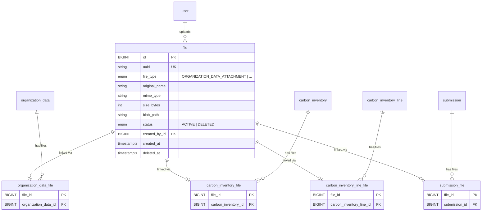

# Almacenamiento de Archivos (File Upload & Download)

## Tabla de Contenidos

- [Descripción General](#descripción-general)
- [Modelo de Datos](#modelo-de-datos)
  - [Decisiones de Diseño](#decisiones-de-diseño)
  - [Enums](#enums)
  - [Tablas](#tablas)
  - [Diagrama ER (parcial)](#diagrama-er-parcial)
- [Infraestructura (Bicep)](#infraestructura-bicep)
  - [Contenedor de Blobs](#contenedor-de-blobs)
  - [RBAC y Managed Identity](#rbac-y-managed-identity)
  - [Variables de Entorno en App Service](#variables-de-entorno-en-app-service)
- [Backend (API)](#backend-api)
  - [Plugin de Blob Storage](#plugin-de-blob-storage)
  - [Autenticación: DefaultAzureCredential](#autenticación-defaultazurecredential)
  - [Estructura de Features](#estructura-de-features)
  - [Helpers de Owner](#helpers-de-owner)
  - [Endpoints](#endpoints)
  - [Almacenamiento en Blob: blobPath](#almacenamiento-en-blob-blobpath)
- [Desarrollo Local](#desarrollo-local)
- [Deployment](#deployment)

---

## Descripción General

El sistema permite subir, listar, descargar y eliminar archivos asociados a dos tipos de entidades:

| Entidad              | Caso de Uso                                  |
| -------------------- | -------------------------------------------- |
| **Organization**     | Documentos generales de la organización      |
| **Carbon Inventory** | Certificaciones y PDFs del inventario de carbono |

Los archivos se almacenan en **Azure Blob Storage** y los metadatos se persisten en **PostgreSQL** a través de Prisma. La autenticación contra Azure Storage se realiza mediante **Managed Identity** (sin claves ni connection strings).

---

## Modelo de Datos

### Decisiones de Diseño

1. **Patrón polimórfico con link tables**: Siguiendo el patrón ya establecido por `SubmissionSubject` en el proyecto, la tabla `file` es genérica y las tablas `organization_data_file`, `carbon_inventory_file`, `carbon_inventory_line_file` y `submission_file` actúan como link tables que vinculan un archivo a su entidad propietaria. Esto evita foreign keys nullable y permite agregar nuevos tipos de archivo en el futuro sin modificar la tabla principal.

2. **Soft delete**: Los archivos no se eliminan físicamente. El campo `status` cambia de `ACTIVE` a `DELETED`. El blob en Azure Storage se preserva (puede limpiarse con un proceso batch posterior).

3. **`blobPath` como único dato de ubicación**: Solo se guarda la ruta relativa dentro del contenedor (ej: `ORGANIZATION_DATA_ATTACHMENT/1/uuid-document.pdf`). El nombre de la cuenta de almacenamiento y el contenedor vienen de variables de entorno, no se duplican por archivo.

4. **Enums del modelo Prisma como fuente de verdad**: `FileType` y `FileStatus` se definen en el schema de Prisma y se re-exportan a través de `@repo/types` para que toda la aplicación (API, tipos compartidos, futuro frontend) use los mismos valores.

5. **`uuid` para referencia externa**: Cada archivo tiene un UUID único que puede usarse como identificador público (en URLs, APIs externas) sin exponer el ID autoincremental interno.

### Enums

```
FileType:   ORGANIZATION_DATA_ATTACHMENT | CARBON_INVENTORY_ATTACHMENT | CARBON_INVENTORY_LINE_INPUT_ATTACHMENT | SUBMISSION_ATTACHMENT
FileStatus: ACTIVE | DELETED
```

### Tablas

#### `file`

Tabla principal que almacena los metadatos de cada archivo subido.

| Columna         | Tipo            | Descripción                                        |
| --------------- | --------------- | -------------------------------------------------- |
| `id`            | BIGINT PK       | Autoincrement                                      |
| `uuid`          | String UNIQUE   | UUID para referencia externa                       |
| `file_type`     | FileType        | Tipo de archivo / entidad a la que pertenece       |
| `original_name` | String          | Nombre original del archivo subido                 |
| `mime_type`     | String          | Tipo MIME (ej: `application/pdf`)                  |
| `size_bytes`    | Int             | Tamaño en bytes                                    |
| `blob_path`     | String          | Ruta relativa en el contenedor de Azure Blob Storage |
| `status`        | FileStatus      | Estado del archivo (`ACTIVE` por defecto)          |
| `created_by_id` | BIGINT FK       | Usuario que subió el archivo → `user(id)`          |
| `created_at`    | DateTime        | Timestamp de creación                              |
| `deleted_at`    | DateTime?       | Timestamp de eliminación (nullable, se establece al hacer soft delete) |

#### `organization_data_file` (link table)

Vincula un archivo a los datos de una organización. Primary key = `file_id`.

| Columna               | Tipo      | Descripción                        |
| --------------------- | --------- | ---------------------------------- |
| `file_id`             | BIGINT PK | FK → `file(id)`                    |
| `organization_data_id`| BIGINT FK | FK → `organization_data(id)`       |

#### `carbon_inventory_file` (link table)

Vincula un archivo a un inventario de carbono. Primary key = `file_id`.

| Columna               | Tipo      | Descripción                        |
| --------------------- | --------- | ---------------------------------- |
| `file_id`             | BIGINT PK | FK → `file(id)`                    |
| `carbon_inventory_id` | BIGINT FK | FK → `carbon_inventory(id)`        |

#### `carbon_inventory_line_file` (link table)

Vincula un archivo a una línea de inventario de carbono. Primary key = `file_id`.

| Columna                     | Tipo      | Descripción                            |
| --------------------------- | --------- | -------------------------------------- |
| `file_id`                   | BIGINT PK | FK → `file(id)`                        |
| `carbon_inventory_line_id`  | BIGINT FK | FK → `carbon_inventory_line(id)`       |

#### `submission_file` (link table)

Vincula un archivo a una submission. Primary key = `file_id`.

| Columna         | Tipo      | Descripción                        |
| --------------- | --------- | ---------------------------------- |
| `file_id`       | BIGINT PK | FK → `file(id)`                    |
| `submission_id` | BIGINT FK | FK → `submission(id)`              |

### Diagrama ER (parcial)



---

## Infraestructura (Bicep)

### Contenedor de Blobs

El Storage Account ya existía en `infra/modules/storage.bicep`. Se agregó un **Blob Service** y un **contenedor `files`** con acceso público deshabilitado:

```bicep
// infra/modules/storage.bicep

resource blobService '...' = {
  parent: storage
  name: 'default'
}

resource filesContainer '...' = {
  parent: blobService
  name: 'files'
  properties: {
    publicAccess: 'None'   // Sin acceso anónimo
  }
}
```

**¿Por qué `publicAccess: 'None'`?** Todos los archivos se acceden a través de la API (que valida autenticación). No hay motivo para exponer blobs directamente a internet.

### RBAC y Managed Identity

En lugar de usar connection strings o account keys (secretos estáticos que pueden filtrarse), el App Service se autentica contra el Storage Account usando su **Managed Identity**.

Se creó `infra/modules/storageRoleAssignment.bicep` que asigna el rol **Storage Blob Data Contributor** al App Service:

```bicep
// infra/modules/storageRoleAssignment.bicep

// Role: Storage Blob Data Contributor
// Built-in role ID: ba92f5b4-2d11-453d-a403-e96b0029c9fe
// Docs: https://learn.microsoft.com/en-us/azure/role-based-access-control/built-in-roles/storage#storage-blob-data-contributor
//
// Permisos:
//   - Leer, escribir y eliminar blobs y contenedores
//   - NO otorga acceso a administrar la cuenta de storage (claves, networking, etc.)
resource storageBlobContributor 'Microsoft.Authorization/roleAssignments@2022-04-01' = {
  name: guid(storageAccount.id, principalId, 'storage-blob-data-contributor')
  scope: storageAccount
  properties: {
    roleDefinitionId: subscriptionResourceId(
      'Microsoft.Authorization/roleDefinitions',
      'ba92f5b4-2d11-453d-a403-e96b0029c9fe'
    )
    principalId: principalId         // App Service Managed Identity
    principalType: 'ServicePrincipal'
  }
}
```

**¿Por qué Managed Identity en lugar de claves?**

| Aspecto           | Account Keys / Connection Strings | Managed Identity (RBAC) |
| ----------------- | --------------------------------- | ----------------------- |
| Secretos          | Sí (deben rotarse)               | No                      |
| Riesgo de filtración | Alto (logs, código, .env)      | Ninguno                 |
| Rotación          | Manual                            | Automática (Azure AD)   |
| Principio mínimo privilegio | No (acceso total)      | Sí (solo blobs)         |

### Wiring en `main.bicep`

El módulo de role assignment se conecta en `infra/main.bicep`:

```bicep
module appServiceStorageBlobContributor 'modules/storageRoleAssignment.bicep' = {
  name: 'appServiceStorageBlobContributor'
  params: {
    storageAccountName: storage.outputs.name
    principalId: appService.outputs.principalId
  }
}
```

### Variables de Entorno en App Service

El módulo `infra/modules/appService.bicep` recibe el nombre de la cuenta de storage y lo inyecta como app settings:

| Variable                       | Valor                 | Descripción                          |
| ------------------------------ | --------------------- | ------------------------------------ |
| `AZURE_STORAGE_ACCOUNT_NAME`   | Nombre de la cuenta   | Se pasa desde `main.bicep`           |
| `AZURE_STORAGE_CONTAINER_NAME` | `files`               | Fijo, coincide con el contenedor en Bicep |

Estas variables **solo se inyectan si `storageAccountName` no es vacío**, usando un array condicional en Bicep.

---

## Backend (API)

### Plugin de Blob Storage

**Archivo**: `apps/api/src/plugins/app/blobStoragePlugin.ts`

Sigue el patrón de plugins de Fastify del proyecto (similar a `prisma.ts`):

1. Lee `AZURE_STORAGE_ACCOUNT_NAME` de las variables de entorno
2. Si no está configurado, decora con `undefined` y muestra un warning (permite correr la API sin storage para desarrollo)
3. Crea un `BlobServiceClient` usando `DefaultAzureCredential`
4. Obtiene un `ContainerClient` para el contenedor configurado
5. En el hook `onReady`, verifica que el contenedor existe (warning si no)
6. Decora la instancia de Fastify con `blobStorage`

```typescript
// Tipo augmentado en apps/api/src/types/fastify.ts
declare module "fastify" {
  interface FastifyInstance {
    blobStorage?: ContainerClient;
  }
}
```

### Autenticación: DefaultAzureCredential

`DefaultAzureCredential` de `@azure/identity` prueba automáticamente múltiples métodos de autenticación en orden:

| Entorno      | Método utilizado                     |
| ------------ | ------------------------------------ |
| **Producción** (App Service) | Managed Identity del App Service |
| **Local** (con `az login`)   | Credenciales de Azure CLI        |

No se necesita configuración diferente por entorno. El SDK selecciona el método correcto automáticamente.

### Estructura de Features

Cada operación de archivos sigue el patrón `route → handler → service`:

```
apps/api/src/features/files/
├── errors.ts                    # Errores de dominio (404, 503, 500)
├── mappers.ts                   # Prisma File → API response
├── ownerHelpers.ts              # Helpers compartidos por file type
├── uploadFile/
│   ├── route.ts                 # POST /:fileType/:ownerId
│   ├── handler.ts               # Parse multipart, validaciones
│   └── service.ts               # Upload blob + crear registros en DB
├── getFiles/
│   ├── route.ts                 # GET /:fileType/:ownerId
│   ├── handler.ts
│   └── service.ts               # Consulta archivos por owner
├── downloadFile/
│   ├── route.ts                 # GET /:fileType/:ownerId/files/:fileId/download
│   ├── handler.ts               # Stream blob → response
│   └── service.ts               # Verificar ownership + obtener blob stream
└── deleteFile/
    ├── route.ts                 # DELETE /:fileType/:ownerId/files/:fileId
    ├── handler.ts
    └── service.ts               # Soft delete (status → DELETED)
```

### Helpers de Owner

**Archivo**: `apps/api/src/features/files/ownerHelpers.ts`

Para evitar duplicación de código entre los distintos tipos de archivo, se crearon tres helpers que encapsulan la lógica polimórfica:

| Función               | Responsabilidad                                          |
| --------------------- | -------------------------------------------------------- |
| `validateOwnerExists` | Verifica que la entidad propietaria exista en DB         |
| `createFileLink`      | Crea el registro en la link table correcta según `FileType` |
| `findFileIdsByOwner`  | Consulta los IDs de archivos vinculados a un owner       |

Todas usan el enum `FileType` importado de `@repo/types` (que re-exporta el enum de Prisma):

```typescript
import { FileType } from "@repo/types";

if (fileType === FileType.ORGANIZATION_DATA_ATTACHMENT) {
  // → prisma.organizationDataFile...
} else if (fileType === FileType.CARBON_INVENTORY_ATTACHMENT) {
  // → prisma.carbonInventoryFile...
} else if (fileType === FileType.CARBON_INVENTORY_LINE_INPUT_ATTACHMENT) {
  // → prisma.carbonInventoryLineFile...
} else if (fileType === FileType.SUBMISSION_ATTACHMENT) {
  // → prisma.submissionFile...
}
```

### Endpoints

Todos los endpoints están bajo `/api/files/` y requieren autenticación.

| Método   | Ruta                                              | Descripción      | Response |
| -------- | ------------------------------------------------- | ---------------- | -------- |
| `POST`   | `/api/files/:fileType/:ownerId`                   | Subir archivo    | 201      |
| `GET`    | `/api/files/:fileType/:ownerId`                   | Listar archivos  | 200      |
| `GET`    | `/api/files/:fileType/:ownerId/files/:fileId/download` | Descargar archivo | Stream  |
| `DELETE` | `/api/files/:fileType/:ownerId/files/:fileId`     | Eliminar archivo (soft) | 200 |

**Parámetros de ruta**:
- `fileType`: `ORGANIZATION_DATA_ATTACHMENT` | `CARBON_INVENTORY_ATTACHMENT` | `CARBON_INVENTORY_LINE_INPUT_ATTACHMENT` | `SUBMISSION_ATTACHMENT`
- `ownerId`: ID de la entidad propietaria (según `fileType`: organization_data, carbon_inventory, carbon_inventory_line, o submission)
- `fileId`: ID del archivo

### Almacenamiento en Blob: blobPath

Cada archivo se almacena en el blob con una ruta estructurada:

```
{fileType}/{ownerId}/{uuid}-{sanitizedOriginalName}
```

**Ejemplo**: `ORGANIZATION_DATA_ATTACHMENT/42/a1b2c3d4-reporte-anual.pdf`

- `fileType` y `ownerId` organizan los blobs por entidad
- `uuid` garantiza unicidad (evita colisiones de nombres)
- `sanitizedOriginalName` preserva legibilidad (caracteres especiales reemplazados por `_`)

Solo el `blobPath` se guarda en la base de datos. La URL completa se reconstruye en runtime:

```
https://{AZURE_STORAGE_ACCOUNT_NAME}.blob.core.windows.net/{AZURE_STORAGE_CONTAINER_NAME}/{blobPath}
```

---

## Desarrollo Local

Para probar el upload/download de archivos localmente se necesita una cuenta de Azure Storage real:

### Permisos RBAC automáticos para desarrolladores

El rol **Storage Blob Data Contributor** se asigna automáticamente al grupo de desarrolladores (`AZURE_SUBSCRIPTION_GROUP`) durante el deployment de infraestructura, controlado por el parámetro `enableDevGroupStorageAccess`:

- **Development** (`main.development.bicepparam`): `enableDevGroupStorageAccess = true` — todos los miembros del grupo de desarrolladores reciben acceso automáticamente al ejecutar `deploy.sh`.
- **Production/Staging**: `enableDevGroupStorageAccess = false` (default) — solo el App Service Managed Identity tiene acceso.

Esto se implementa en `main.bicep` como un módulo condicional que reutiliza `storageRoleAssignment.bicep` con `principalType: 'Group'`:

```bicep
module devGroupStorageBlobContributor 'modules/storageRoleAssignment.bicep' = if (enableDevGroupStorageAccess && devGroupObjectId != '') {
  params: {
    storageAccountName: storage.outputs.name
    principalId: devGroupObjectId
    principalType: 'Group'
  }
}
```

### Pasos

1. **Asegurarse de pertenecer al grupo Azure AD** configurado en `AZURE_SUBSCRIPTION_GROUP` (los permisos se asignan automáticamente al grupo al ejecutar `deploy.sh`)

2. **Iniciar sesión con Azure CLI**:
   ```bash
   az login
   ```

3. **Configurar variables en `.envrc`**:
   ```bash
   # Azure Blob Storage (local development only)
   # In production these are set automatically by the Bicep infrastructure (appService.bicep).
   export AZURE_STORAGE_ACCOUNT_NAME="nombre-de-tu-cuenta"
   export AZURE_STORAGE_CONTAINER_NAME="files"
   ```

4. **Iniciar la API**: `pnpm --filter apps/api dev`

`DefaultAzureCredential` usará automáticamente la sesión de `az login` para autenticarse.

**Nota**: Si no se configura `AZURE_STORAGE_ACCOUNT_NAME`, la API arranca normalmente pero los endpoints de archivos responderán con error 503.

---

## Deployment

**No se requieren cambios en los scripts de deployment** (`deploy.sh`, `deploy-api.sh`).

La infraestructura de Bicep maneja todo:
- `storage.bicep` crea el contenedor `files`
- `storageRoleAssignment.bicep` asigna el rol RBAC al App Service (y opcionalmente al grupo de desarrolladores)
- `appService.bicep` inyecta las variables de entorno `AZURE_STORAGE_ACCOUNT_NAME` y `AZURE_STORAGE_CONTAINER_NAME`

Al ejecutar `./infra/deploy.sh`, los nuevos recursos se crean o actualizan automáticamente como parte del Deployment Stack existente.

---

## Archivos Involucrados

### Archivos Creados

| Archivo | Propósito |
| ------- | --------- |
| `infra/modules/storageRoleAssignment.bicep` | RBAC: App Service → Storage |
| `apps/api/src/plugins/app/blobStoragePlugin.ts` | Plugin de Fastify para blob storage |
| `apps/api/src/features/files/errors.ts` | Errores de dominio |
| `apps/api/src/features/files/mappers.ts` | Prisma → API response |
| `apps/api/src/features/files/ownerHelpers.ts` | Helpers polimórficos por tipo de archivo |
| `apps/api/src/features/files/uploadFile/` | Feature: subir archivo |
| `apps/api/src/features/files/getFiles/` | Feature: listar archivos |
| `apps/api/src/features/files/downloadFile/` | Feature: descargar archivo |
| `apps/api/src/features/files/deleteFile/` | Feature: eliminar archivo (soft) |
| `apps/api/src/routes/api/files/index.ts` | Registro de rutas |
| `packages/types/src/files/` | Schemas Zod y tipos compartidos |
| `packages/database/.../20260216171318_add_file_tables` | Migración de Prisma |

### Archivos Modificados

| Archivo | Cambio |
| ------- | ------ |
| `packages/database/src/prisma/schema.prisma` | Modelos `File`, `OrganizationDataFile`, `CarbonInventoryFile`, `CarbonInventoryLineFile`, `SubmissionFile` + enums |
| `infra/modules/storage.bicep` | Blob service + contenedor `files` |
| `infra/modules/appService.bicep` | Parámetro `storageAccountName` + app settings |
| `infra/main.bicep` | Módulo `storageRoleAssignment` + pasar storage name al App Service |
| `apps/api/src/config/environment.ts` | Variables `AZURE_STORAGE_ACCOUNT_NAME`, `AZURE_STORAGE_CONTAINER_NAME` |
| `apps/api/src/types/fastify.ts` | Augment `FastifyInstance` con `blobStorage` |
| `packages/types/src/enums.ts` | Re-export `FileType`, `FileStatus` |
| `packages/types/src/index.ts` | Export `./files/index.js` |
| `.envrc.template` | Variables de storage para desarrollo local |

---

## Referencias

- [Azure Blob Storage — Documentación](https://learn.microsoft.com/en-us/azure/storage/blobs/)
- [DefaultAzureCredential](https://learn.microsoft.com/en-us/javascript/api/@azure/identity/defaultazurecredential)
- [Storage Blob Data Contributor Role](https://learn.microsoft.com/en-us/azure/role-based-access-control/built-in-roles/storage#storage-blob-data-contributor)
- [Managed Identities for Azure Resources](https://learn.microsoft.com/en-us/entra/identity/managed-identities-azure-resources/overview)
