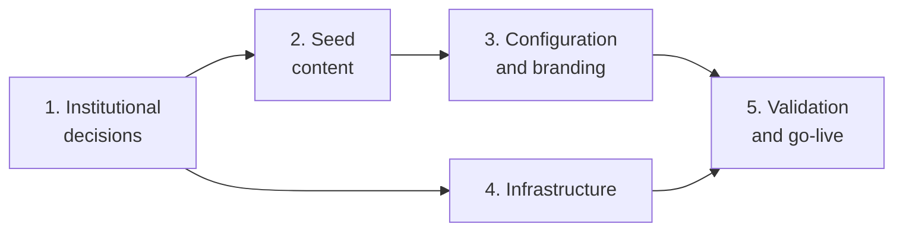

# Country Implementation Guide

A country needs five phases to run Huella Latam in production, and the longest one is not the
technical one: it is replacing the seed content. The seed shipped in the repository is a fictional
country ("País Demo", code `PD`) with a "Metodología inicial" (initial methodology) of 30
subcategories and 284 emission factors, taken mostly from DEFRA 2025 (United Kingdom) and the IPCC.
None of it is fit, as is, for a national carbon footprint program.

This guide walks the whole path, from the institutional decision to the first real user. It
complements the field-level reference
[`../development/country-onboarding.md`](../development/country-onboarding.md), which documents
every seed JSON file field by field.

## Who it is for

| Team                                          | Contributes                                                 | Leads in phases |
| --------------------------------------------- | ----------------------------------------------------------- | --------------- |
| Environmental authority (institutional owner) | Scope, methodological framework, roles and legal contacts   | 1, 5            |
| Methodology team (GHG specialists)            | Emission factors, categories, dimensions, explanatory texts | 2               |
| Content / communications team                 | Public pages, partners, logos, terms and conditions         | 3               |
| National IT team                              | Servers or cloud, database, file storage, identity provider | 4               |
| Huella Latam team (upstream)                  | Guidance, seed review, technical support                    | All             |

## Phases

Phases 2 and 4 run in parallel: the methodology team prepares the seed while IT prepares the
infrastructure. Both converge in phase 5.

## Contents

| #   | Document                                                         | What it covers                                                                                           |
| --- | ---------------------------------------------------------------- | -------------------------------------------------------------------------------------------------------- |
| 1   | [Institutional decisions](./01-institutional-decisions.md)       | The 10 upfront decisions: operator, methodological framework, factors, roles, cloud vs on-premise, login |
| 2   | [Seed content](./02-seed-content.md)                             | Which seed files to replace, who owns each, critical points and rules for the explanations               |
| 3   | [Configuration and branding](./03-configuration-and-branding.md) | Partners, logos, public pages and per-country values compiled into the image                             |
| 4   | [Infrastructure](./04-infrastructure.md)                         | Cloud and on-premise paths, IT checklist, first-deploy sequence, known field issues                      |
| 5   | [Validation and go-live](./05-validation-and-go-live.md)         | Seed and functional validation, legal obligations, pilot, training and operations                        |
| 6   | [Master checklist and timeline](./06-checklist-and-timeline.md)  | Deliverable, owner and reference duration for each phase                                                 |

## Two rules worth knowing from day one

- **One deployment serves one country.** The API takes the first seeded country as the default
  country ([`resolveDefaultCountryId.ts`](../../apps/api/src/helpers/resolveDefaultCountryId.ts)).
  Two countries mean two instances.
- **The seed runs only once.** It is applied only to an empty database. After the first boot, the
  catalogue is maintained through the maintainer screens, not by editing JSON. That is why the
  country content must be ready and validated before seeding production
  ([phase 2](./02-seed-content.md)).
