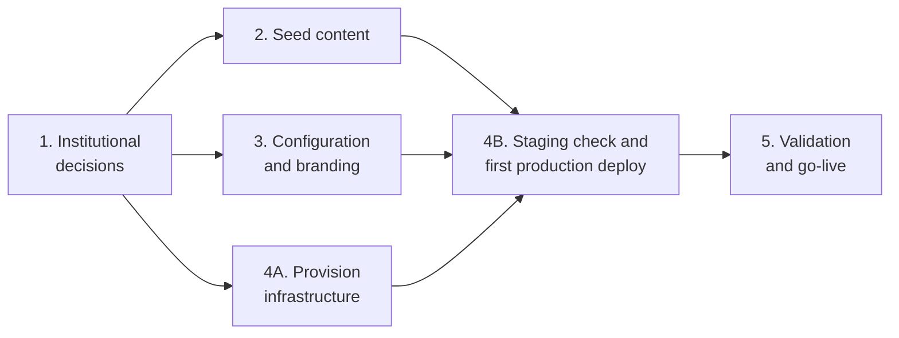

# Country Implementation Guide

A country needs five phases (the fourth in two parts) to run Huella Latam in production, and the longest one is not the
technical one: it is replacing the seed content. The seed shipped in the repository is a fictional
country ("País Demo", code `PD`) with a "Metodología inicial" (initial methodology) of 30
subcategories and 284 emission factors per year (2025 and 2026), taken mostly from DEFRA (United
Kingdom) and the IPCC.
None of it is fit, as is, for a national carbon footprint program.

This guide walks the whole path, from the institutional decision to the first real user. It
complements the field-level reference
[`../development/country-onboarding.md`](../development/country-onboarding.md), which documents
every seed JSON file field by field.

## Who it is for

| Team                                          | Contributes                                                    | Leads in phases      |
| --------------------------------------------- | -------------------------------------------------------------- | -------------------- |
| Environmental authority (institutional owner) | Scope, methodological framework, roles and legal contacts      | 1, 5                 |
| Methodology team (GHG specialists)            | Emission factors, categories, dimensions, explanatory texts    | 2                    |
| Content / communications team                 | Copy for public pages, partner logos, terms and conditions     | 3 (with a developer) |
| Developer (national or upstream)              | Runs seed validation, edits configuration files, builds images | 3, 4B; supports 2    |
| National IT team                              | Servers or cloud, database, file storage, identity provider    | 4A, 4B               |
| Huella Latam team (upstream)                  | Guidance, seed review, technical support                       | All                  |

**A developer is required.** Seed validation runs `pnpm` commands, and phase 3 edits TypeScript
files that are compiled into the web image. The methodology and content teams produce the content;
a developer with Node.js and Docker puts it in place and runs the checks.

## Phases and critical path

Phases 2, 3 and 4A run in parallel once phase 1 is closed. The first production deploy (4B) waits
for all three: the images need the phase 3 configuration, and production is seeded only once, with
the validated phase 2 content, after staging passes the functional checks with that same version. The critical path is **1 → 2 → 4B → 5**, and its longest step is the
emission factor catalogue.

## Contents

| #   | Document                                                         | What it covers                                                                                         |
| --- | ---------------------------------------------------------------- | ------------------------------------------------------------------------------------------------------ |
| 1   | [Institutional decisions](./01-institutional-decisions.md)       | The 10 upfront decisions, roles, legal footing (license, brand), budget and staffing                   |
| 2   | [Seed content](./02-seed-content.md)                             | Which seed files to replace, who owns each, critical points, explanation rules and the validation gate |
| 3   | [Configuration and branding](./03-configuration-and-branding.md) | Partners, logos, public pages and per-country values compiled into the image                           |
| 4   | [Infrastructure](./04-infrastructure.md)                         | Choosing a path, identity provider, staging gate, rollback, security references                        |
|     | ↳ [On-premise path](./04-path-on-premise.md)                     | Docker Compose on the country's servers: IT request, DBA setup, env file, deploy, backups              |
|     | ↳ [Azure path](./04-path-azure.md)                               | Bicep on Azure: IT request, configuration, deploy, backups                                             |
| 5   | [Validation and go-live](./05-validation-and-go-live.md)         | Legal obligations, transparency, personal data, review process, pilot, yearly cycle, upstream releases |
| 6   | [Master checklist and timeline](./06-checklist-and-timeline.md)  | Deliverable, owner and reference duration for each phase                                               |

## Rules worth knowing from day one

- **One deployment serves one country.** The API takes the first seeded country as the default
  country ([`resolveDefaultCountryId.ts`](../../apps/api/src/helpers/resolveDefaultCountryId.ts)).
  Two countries mean two instances.
- **The seed runs only once.** It is applied only to an empty database. After production is
  seeded, the catalogue is maintained through the maintainer screens (the admin screens where
  system administrators edit it), not by editing JSON; a few items need SQL. That is why the
  country content must be validated before production is seeded ([phase 2](./02-seed-content.md)).
- **Calculated footprints do not change when a factor changes.** Every calculated line stores the
  factor value it used, so editing or deleting a factor later only affects lines calculated
  afterwards ([phase 2](./02-seed-content.md#factor-corrections-and-past-footprints)).
