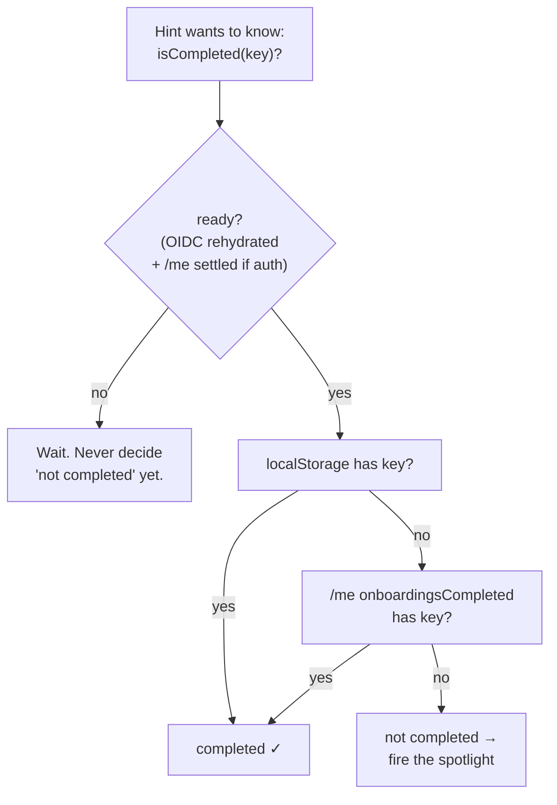
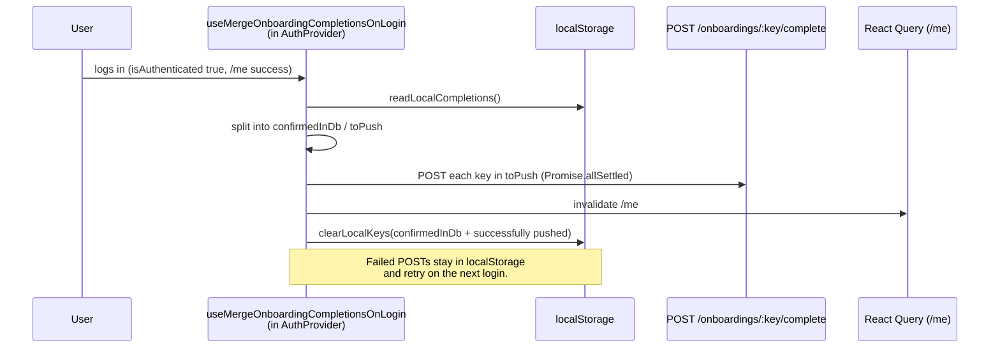
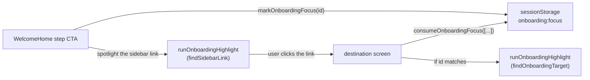
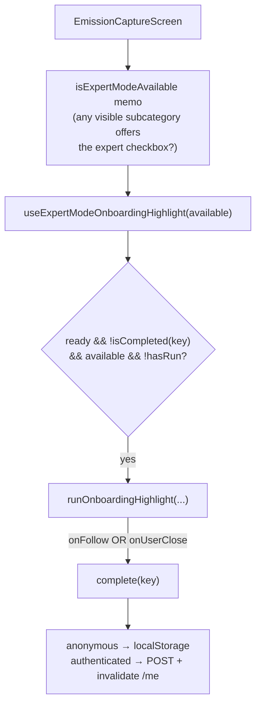

# In-App Onboarding & Spotlights

How Huella Latam guides users through the product with **spotlights** (driver.js
popovers that highlight one control) and how it remembers, per user, which of
those hints have already been shown.

> Not to be confused with the [Country Onboarding Guide](./country-onboarding.md),
> which is about deploying the platform in a new country. This document is about
> the **end-user onboarding UI**.

---

## TL;DR

There are two distinct experiences built on the same two primitives:

1. **The home flow** — a guided "next steps" checklist on `/` that walks a new
   user from "no organization" to "huella autodeclarada". Each step spotlights a
   sidebar link, and the destination screen spotlights the exact control to
   click. Gated by the `welcome-home` completion key, which is **DB-only**
   (only reachable while authenticated).

2. **One-time in-screen hints** — a single explanatory spotlight on a specific
   control the first time a user sees it (currently: the "expert mode" checkbox
   in the emission editor). One of these _may_ live on a screen reachable
   **without a session** (the calculator is anonymous); when it can, its
   completion state lives in **localStorage ∪ DB**. A hint on an
   authenticated-only screen is DB-only, exactly like the home flow.

Both are built from:

- **`runOnboardingHighlight`** (`apps/web/src/utils/onboardingHighlight.ts`) — the
  driver.js wrapper that shows one popover and reports how it was closed.
- **The completion model** — did this user already see/dismiss this hint? Answered
  by `useOnboardingCompletion` for session-agnostic keys, or straight from `/me`
  for DB-only keys.

> **Assumed background.** This doc assumes the app's stack from
> [Frontend Architecture](./frontend-architecture.md) (OIDC auth, TanStack Query,
> `ky`, Zustand) and the [API conventions](./api-conventions.md) (`access` modes,
> route/handler/service). Terms like _structural sharing_, `isAuthenticated`, and
> `access: private` are used without re-introduction.

---

## Glossary

| Term                              | Meaning                                                                                                                                                                                                                                                                                                                 |
| --------------------------------- | ----------------------------------------------------------------------------------------------------------------------------------------------------------------------------------------------------------------------------------------------------------------------------------------------------------------------- |
| **Onboarding key**                | A permanent string id for one hint. Enum in `packages/types` (`OnboardingKeySchema`). Also a DB column value, so keys are **append-only** — never rename or recycle.                                                                                                                                                    |
| **Completion**                    | The fact that a given user has finished/dismissed a given key. Persisted in the DB (`user_onboarding_completion`) and/or in the browser (localStorage) for anonymous keys.                                                                                                                                              |
| **Spotlight / highlight**         | A one-off driver.js popover pointing at a single DOM element. Created by `runOnboardingHighlight`.                                                                                                                                                                                                                      |
| **Target id (`OnboardingFocus`)** | The string-union type of every spotlight target id (in `onboardingSignals.ts`). `onboardingTargetProps(id)` and the resolvers are typed to it, so **every** tagged control — home flow _and_ in-screen hint — must have its id in this union. It is _not_ home-flow-only despite the file name.                         |
| **Target tag**                    | The `data-onboarding-id="<id>"` attribute stamped on a control (`onboardingTargetProps`) so a spotlight can resolve it by a stable selector instead of by button text.                                                                                                                                                  |
| **Focus signal**                  | A separate mechanism from the id union above: a one-shot, cross-screen hint (sessionStorage, keyed `onboarding:focus`) that carries an `OnboardingFocus` id saying "when you land on screen X, spotlight control Y". **Only the home flow uses it** — in-screen hints resolve their target directly and never touch it. |

---

## File map

| Layer                   | File                                                                             | Responsibility                                                                                                                               |
| ----------------------- | -------------------------------------------------------------------------------- | -------------------------------------------------------------------------------------------------------------------------------------------- |
| types                   | `packages/types/src/baseSchemas/onboarding.ts`                                   | `OnboardingKeySchema` (the enum) + `OnboardingKeys` named accessors. **Single source of truth for valid keys.**                              |
| api                     | `apps/api/src/features/users/completeOnboarding/`                                | `POST /users/me/onboardings/:key/complete` — idempotent upsert.                                                                              |
| api                     | `apps/api/src/features/users/getMe/`                                             | `GET /users/me` returns `onboardingsCompleted: OnboardingKey[]` (cross-device source of truth).                                              |
| web · primitive         | `apps/web/src/utils/onboardingHighlight.ts`                                      | `runOnboardingHighlight`, `HighlightSpec`, `onboardingTargetProps`, resolvers (`findOnboardingTarget`, `findSidebarLink`, `findBySelector`). |
| web · signals           | `apps/web/src/utils/onboardingSignals.ts`                                        | `OnboardingFocus` id union + sessionStorage focus signal (`markOnboardingFocus` / `consumeOnboardingFocus` / `clearOnboardingFocus`).        |
| web · completion        | `apps/web/src/utils/onboardingCompletionStorage.ts`                              | localStorage layer for anonymous-reachable keys (read/write/clear + `ANONYMOUS_REACHABLE_KEYS`).                                             |
| web · completion        | `apps/web/src/hooks/useOnboardingCompletion.ts`                                  | Unified `{ ready, isCompleted, complete }` across all session states. **The hook a hint should use.**                                        |
| web · completion        | `apps/web/src/hooks/useMergeOnboardingCompletionsOnLogin.ts`                     | On login, pushes local completions to the DB and prunes them. Mounted once in `AuthProvider`.                                                |
| web · api hook          | `apps/web/src/api/query/users/useCompleteOnboarding.ts`                          | Mutation + `onboardingCompletePath` (shared path builder). Invalidates `/me`.                                                                |
| web · home flow         | `apps/web/src/screens/Home/components/WelcomeHome.tsx` + `onboardingSteps.ts`    | The next-steps checklist and step→sidebar spotlight wiring.                                                                                  |
| web · destination hooks | `apps/web/src/screens/**/hooks/use*Highlight.ts`                                 | Consume a focus signal and spotlight the target on arrival (e.g. `useCarbonInventoriesHighlight`, `useMyOrganizationHighlight`).             |
| web · in-screen hint    | `apps/web/src/screens/CarbonInventory/hooks/useExpertModeOnboardingHighlight.ts` | The expert-mode one-time hint (reference implementation of a session-agnostic hint).                                                         |

---

## The completion model

This is the part that trips people up, so it comes first.

A user is always in one of three session states, and "has this hint been seen?"
must be answered correctly in all three:

| Session state                   | Source of truth                                 | Notes                                                                |
| ------------------------------- | ----------------------------------------------- | -------------------------------------------------------------------- |
| **Authenticated**               | DB via `GET /users/me` → `onboardingsCompleted` | Cross-device.                                                        |
| **Anonymous**                   | `localStorage`                                  | Per-browser. Only for keys in `ANONYMOUS_REACHABLE_KEYS`.            |
| **Transition (just logged in)** | both, then merged                               | `useMergeOnboardingCompletionsOnLogin` copies local → DB and prunes. |

**Effective completion = `localStorage ∪ DB`.** `useOnboardingCompletion`
computes this and is what a hint should consume.

> **Scope.** This three-state model is for **session-agnostic** keys — those in
> `ANONYMOUS_REACHABLE_KEYS`, read/written through `useOnboardingCompletion`. A
> **DB-only** key (e.g. `welcome-home`, and any hint on an authenticated-only
> screen) never touches the local layer: it just reads `/me` and writes via
> `useCompleteOnboarding`. The union collapses to "the DB" for those.



### The three invariants

1. **The `ready` gate.** `ready = !oidc.isLoading && (isAuthenticated ? meQuery.isSuccess : true)`.
   A consumer must **never** decide "not completed" (and fire a hint) before
   `ready` is true. Otherwise a returning user who already dismissed a hint sees
   it flash again on a deep-link while `/me` is still loading.

2. **Never POST without a session.** When anonymous, `complete(key)` writes
   **only** to localStorage — it does not call the API. (Posting while anonymous
   was a real bug that produced a silent 401.) The login merge syncs it later.

3. **Write to the DB, not local, when authenticated.** This is a rule about
   _where a completion is written_, not about read precedence — reads are always
   the `localStorage ∪ DB` union above. When authenticated, `complete` goes
   straight to the DB (via `useCompleteOnboarding`, which invalidates `/me`) and
   writes **nothing** locally — a local entry would only linger until the next
   login merge pruned it.

### Login merge



Key properties, all deliberate:

- **Idempotent, one POST per key.** No batch endpoint (only a handful of
  onboarding keys exist, and at most the anonymous-reachable ones can ever be
  pending at once). Uses the same `onboardingCompletePath` builder as the
  mutation so the two request URLs can't drift.
- **Prune only what's confirmed.** A key is removed from localStorage only if it
  was already in the DB or its POST resolved. Failures are retried next login.
- **No logout/expiry handling.** Pruning is tied to a successful merge, not to
  session teardown, so session expiry is irrelevant.
- **`hasMergedRef`** runs the merge once per login and prevents the `/me`
  invalidation from looping back into another merge.

### Accepted residual

Anonymous → anonymous on the **same browser** with no session event in between
(person A dismisses a hint and leaves without logging in; person B arrives
anonymous) → B inherits A's dismissed hint. This is documented and **not
handled**: it's an explanatory popover, not data, and it's inherent to anonymous
storage. See the header comment in `onboardingCompletionStorage.ts`.

Be aware of the **downstream consequence**: if B _then logs in_, the login merge
(which reads whatever is in localStorage, with no notion of who wrote it) will
POST A's inherited dismissal into **B's** account, making it a permanent DB
record for B. Still acceptable for a hint-suppression flag, but note it is not
purely a display quirk — it can persist cross-user. Don't put anything more
sensitive than "a hint was seen" behind this local layer.

### Why localStorage keys are sliced, not split

The localStorage item is `"huella-latam:onboarding-complete:v1:" + key`, and the
**prefix itself contains colons**. The key is recovered by `slice(PREFIX.length)`
— **never** `split(":")`, which would break on the prefix's colons alone. By
convention keys use hyphens (so a key never adds its own colon — see the
"separator-consistent" gotcha), but `OnboardingKeySchema` doesn't _enforce_ that,
so the recovery stays defensive regardless of what a future key contains. Each
recovered suffix is validated with `OnboardingKeySchema`; unknown/forward-compat
suffixes are ignored but left in place. Any storage failure (private mode, quota)
degrades to an empty set rather than throwing.

---

## The spotlight primitive

`runOnboardingHighlight(spec): () => void` shows one driver.js popover and
returns a cleanup function. It polls the DOM for the target (screens/grids load
async, up to ~5s), and no-ops silently if the target never appears (with a
dev-only `console.warn` keyed by `debugLabel`).

`HighlightSpec` fields worth knowing:

| Field                   | Purpose                                                                                                                                                                                                                                                                    |
| ----------------------- | -------------------------------------------------------------------------------------------------------------------------------------------------------------------------------------------------------------------------------------------------------------------------- |
| `find`                  | `() => HTMLElement \| null` — resolve the element (usually `findOnboardingTarget(id)`). Retried until it appears.                                                                                                                                                          |
| `title` / `description` | Popover copy (Spanish).                                                                                                                                                                                                                                                    |
| `onUserClose`           | Fires **only** on an explicit close (✕ / overlay / Esc / the confirm button) — i.e. the user dismissed without following.                                                                                                                                                  |
| `onFollow`              | Fires when the user **clicks the spotlighted control** (which self-destroys the tour). Distinct from `onUserClose` so a hint can be marked seen on engagement.                                                                                                             |
| `confirmLabel`          | Opt-in. When set, the popover shows one acknowledge button with this label (plus the ✕); clicking it routes through the same close path as ✕, so `onUserClose` fires. Leave unset for the default buttonless spotlight — **other callers rely on the buttonless default**. |
| `onDismiss`             | Fires once whenever the highlight ends (click, close, or cleanup). Use it to undo setup, e.g. releasing a force-opened sidebar.                                                                                                                                            |
| `delayMs`               | Delay before the first find attempt (default 300). Raise it to wait out an animation before positioning the popover.                                                                                                                                                       |
| `debugLabel`            | Names the target in the dev-only "never resolved" warning.                                                                                                                                                                                                                 |

**Close semantics at a glance:**

- Click the spotlighted control → `onFollow` → tour self-destroys → **no**
  `onUserClose`.
- ✕ / overlay / Esc / confirm button → `onUserClose` → `onDismiss`.
- Effect cleanup / unmount before any close → `onDismiss` only (no persistence).
  This is intentional: an accidental navigation away must not silently burn a
  one-time hint.

---

## Flow 1 — The home "next steps" flow

Entirely authenticated; the `welcome-home` key is **DB-only** (excluded from the
local layer). It does not use `useOnboardingCompletion` — it reads
`onboardingsCompleted` off the **user store** (the Zustand `useUserStore`,
hydrated from `/me`) and persists via `useCompleteOnboarding`.



1. `WelcomeHome` renders a checklist derived from `ONBOARDING_STEPS` and the
   user's real state (has org? accredited? has huella? etc.). It never redirects
   automatically — the active step **spotlights the sidebar link** so the user
   navigates themselves.
2. Clicking an active step's CTA calls `markOnboardingFocus(id)` (writes to
   sessionStorage, **not** the URL — a transient hint, not bookmarkable) and
   spotlights that route's sidebar link. It does **not** navigate; the user
   clicks the spotlighted link themselves. (The "Usar calculadora" escape-hatch
   button is the one exception — it marks focus **and** navigates directly.)
3. The destination screen mounts a `use*Highlight` hook that calls
   `consumeOnboardingFocus([...ids it handles])`. This is a **peek-then-consume-on-match**:
   a focus meant for another screen is left pending so it resolves where it
   belongs.
4. `clearOnboardingFocus` drops a pending focus the user chose not to follow, so
   it doesn't resurface as a surprise highlight on a later organic visit.

---

## Flow 2 — A one-time in-screen hint (expert mode)

The reference implementation for a **session-agnostic** hint. Reachable while
anonymous (the calculator), so it uses `useOnboardingCompletion` and localStorage.



Three parts:

1. **Tag the control** — `EmissionEditorHeader` spreads
   `onboardingTargetProps("emission-capture-expert-mode")` onto the checkbox
   **only when it's actually available/visible**. The wrapper is hidden with
   `display:none` (not unmounted), so an unconditional tag would let the resolver
   pick a hidden checkbox from an earlier subcategory.
2. **Compute availability** — `EmissionCaptureScreen` derives
   `isExpertModeAvailable` (any currently-visible subcategory offers the
   checkbox) and passes it to the hook. This memo **mirrors the render's**
   `shouldShowSubcategory` condition so the hint only fires when a tagged target
   truly exists.
3. **Fire once** — `useExpertModeOnboardingHighlight` fires the spotlight when
   `ready && !isCompleted(key) && isExpertModeAvailable`, guarded by `hasRunRef`
   for a single attempt. It passes `confirmLabel: "Entendido"`, so the popover
   gets one acknowledge button. Both `onFollow` (clicking the checkbox) and
   `onUserClose` (that "Entendido" button, ✕, overlay, or Esc) persist
   completion, so "first-visit-only" holds however the user engages.

> **Guard ordering matters:** `hasRunRef.current = true` is set **after** the
> early-return guard, so `!ready` / `!available` / `already-completed` do not
> burn the one-shot — the hint waits until every condition holds, then fires
> exactly once.

---

## The API

`POST /api/users/me/onboardings/:key/complete` (`access: private`):

- **Idempotent upsert** into `user_onboarding_completion`; re-completing is a
  no-op that preserves the original `completedAt`.
- Returns `204` with an empty body — the web client awaits it **without**
  `.json()` (ky throws on `.json()` of an empty body).
- The `:key` param is validated against `OnboardingKeySchema`; an unknown key is
  `400` and writes nothing.
- **Keep keys separator-consistent.** Onboarding keys use hyphens
  (`emission-capture-expert-mode`) so the key string matches its `data-onboarding-id`
  DOM target and needs no special path/parsing handling. `integration.test.ts`
  covers a second (non-`welcome-home`) key round-tripping through the `:key`
  route param and surfacing in `/me`.

`GET /api/users/me` returns `onboardingsCompleted: OnboardingKey[]` — the
cross-device source of truth the web reads through `useMe`.

---

## Recipe — add a new one-time in-screen hint

Follow the expert-mode implementation. This recipe works the same for an
anonymous-reachable hint and an authenticated-only one — the **only** difference
is step 2.

1. **Add the key** in `packages/types/src/baseSchemas/onboarding.ts`: extend
   `OnboardingKeySchema` and add a named accessor to `OnboardingKeys`. Keys are
   permanent — append, never rename. No DB migration is needed: `onboarding_key`
   is a plain string column; the enum is enforced in Zod, not in the schema.
2. **Decide reachability.** If the control can be seen **without a session**, add
   the key to `ANONYMOUS_REACHABLE_KEYS` in `onboardingCompletionStorage.ts` so
   anonymous dismissals persist locally. If it's authenticated-only, **leave it
   out** (like `welcome-home`) — it will be DB-only. This is the one step that
   differs by reachability. Guardrail: if a key is reachable anonymously but you
   forget to add it here, `complete()` while anonymous drops the dismissal
   silently (no local write, no POST) and the hint re-fires on every anonymous
   load — `useOnboardingCompletion` emits an `IS_DEVELOPMENT` `console.warn` for
   exactly this case, so watch the dev console.
3. **Tag the control** with `{...onboardingTargetProps("<id>")}`, and add `<id>`
   to the `OnboardingFocus` union in `onboardingSignals.ts`. The union entry is
   **required** — `onboardingTargetProps(id)` is typed to `OnboardingFocus`, so
   the code won't compile without it. This is _not_ the sessionStorage focus
   signal (in-screen hints don't use that); you're only extending the shared id
   type. **Tag only when the control is actually visible** (guard against
   `display:none`, or the first-match resolver may pick a hidden instance).

   > **Two ids, one string by convention.** The **completion key** (an
   > `OnboardingKey`, used by `isCompleted`/`complete`) and the **DOM target id**
   > (an `OnboardingFocus`, used by `onboardingTargetProps`/`findOnboardingTarget`)
   > are separate types. Nothing forces them to be equal, but by convention we use
   > the **same literal** for both (e.g. `emission-capture-expert-mode`) so there's
   > one spelling per concept. What the type system does _not_ enforce and you
   > must keep in sync yourself: the `<id>` you tag with (step 3) and the `<id>`
   > you resolve with in the hook (`findOnboardingTarget`/`debugLabel`, step 4)
   > must be the **exact same string**, or the spotlight silently never resolves.

4. **Write the hook** (mirror `useExpertModeOnboardingHighlight`). The public
   contract of `useOnboardingCompletion` is a no-arg hook returning
   `{ ready, isCompleted(key), complete(key) }` — `isCompleted`/`complete` take
   the key each call; `complete` is fire-and-forget (no promise to await). Read
   `isCompleted`/`complete` through **refs** and depend only on
   `[ready, isAvailable]`: their identities change when `/me` or auth updates,
   and if that happened while the popover was open, the effect cleanup would tear
   down a _live_ highlight without persisting completion.

   ```ts
   export const useMyHint = (isAvailable: boolean) => {
     const { ready, isCompleted, complete } = useOnboardingCompletion();
     const hasRunRef = useRef(false);
     const key = OnboardingKeys.MY_HINT;

     // Latest-value refs so the effect never lists isCompleted/complete as deps.
     // Synced in an effect (not during render — the react-hooks/refs lint rule
     // forbids mutating a ref while rendering); NO deps array on purpose, so it
     // runs every render and keeps the refs current, and declared first so it
     // runs before the highlight effect reads them.
     const isCompletedRef = useRef(isCompleted);
     const completeRef = useRef(complete);
     useEffect(() => {
       isCompletedRef.current = isCompleted;
       completeRef.current = complete;
     });

     useEffect(() => {
       // Guard FIRST, set the ref AFTER — so !ready / !isAvailable /
       // already-completed don't burn the one-shot before it can fire.
       if (
         hasRunRef.current ||
         !ready ||
         isCompletedRef.current(key) ||
         !isAvailable
       ) {
         return undefined;
       }
       hasRunRef.current = true;
       return runOnboardingHighlight({
         find: findOnboardingTarget("<id>"),
         title: "…",
         description: "…",
         confirmLabel: "Entendido", // optional acknowledge button
         onFollow: () => completeRef.current(key),
         onUserClose: () => completeRef.current(key),
         debugLabel: "<id>",
       });
     }, [ready, isAvailable]);
   };
   ```

5. **Compute availability** in the screen with a memo that **matches the render
   condition** for the tagged control, and call the hook. If the control is
   always rendered, pass a constant `true`.
6. **Test the key** — extend the `completeOnboarding` integration test with the
   new key (see [The API](#the-api)), and add web unit tests for any new
   storage/derivation logic (see the coverage note below); the storage util and
   the login-merge hook already have co-located tests to mirror.

> **Single attempt per mount.** The hook fires at most once per mount, and
> `runOnboardingHighlight` polls for the target for ~5s then gives up silently.
> If the target isn't in the DOM when the hook fires, the attempt is spent until
> the component remounts — which is exactly why availability is gated _before_
> the ref is set (step 4) and mirrors the render condition (step 5): don't fire
> until the target can actually be found.

## Recipe — add a new home-flow step

1. Add a step to `apps/web/src/screens/Home/components/onboardingSteps.ts` with
   its `id`, target `route`, and guide copy.
2. Add the `id` to the `OnboardingFocus` union.
3. Tag the destination control with `onboardingTargetProps("<id>")`.
4. In the destination screen's `use*Highlight` hook, add the `id` to the
   `consumeOnboardingFocus([...])` list and spotlight it. Remember to
   `clearOnboardingFocus` on user-close so an ignored focus doesn't resurface.

---

## Gotchas & invariants (checklist)

- **Keys are permanent.** Append to `OnboardingKeySchema`; never rename/recycle —
  the value is a DB column.
- **`ready` before deciding.** Never fire a hint before `useOnboardingCompletion`
  reports `ready`.
- **Never POST anonymous.** `complete` writes local-only without a session.
- **DB-only for authenticated-only keys.** Don't add authenticated-only keys to
  `ANONYMOUS_REACHABLE_KEYS`.
- **Keep the key separator-consistent.** Onboarding keys use hyphens so the key
  string equals its `data-onboarding-id` DOM target — one spelling per concept.
- **Slice, don't split.** localStorage suffix recovery uses `slice(PREFIX.length)`
  because the PREFIX contains `:`.
- **Tag only visible controls.** A `display:none` tag would be picked by the
  first-match resolver.
- **Set the fire-once ref after the guard**, not before, or you'll burn the hint
  while it's still waiting on `ready`/availability.
- **Keep `isCompleted`/`complete` out of the highlight effect's deps** (read them
  via refs). Their identity changes on `/me`/auth updates would otherwise tear
  down a live spotlight without persisting completion.
- **Don't persist on unmount/cleanup** — only on follow or explicit close.
- **`/me` reference stability.** React Query structural sharing keeps
  `onboardingsCompleted` referentially stable on a same-content refetch, so
  `isCompleted`'s identity (and the effect deps) won't churn on a background
  refetch — rely on this rather than fighting it.

---

## Testing

- **API:** `completeOnboarding` has integration coverage for the happy path,
  idempotency, unknown-key `400`, colon-in-path routing, and `/me` surfacing.
- **Web:** `test:web` enforces a low global coverage floor meant to be **ratcheted
  up as the logic layers gain tests** (see the root `CLAUDE.md`). The pure
  derivation code here — `onboardingCompletionStorage.ts` (prefix slicing, schema
  rejection, degrade-on-throw) and the completion hooks — is the highest-value
  place to add web unit tests when extending this feature.
